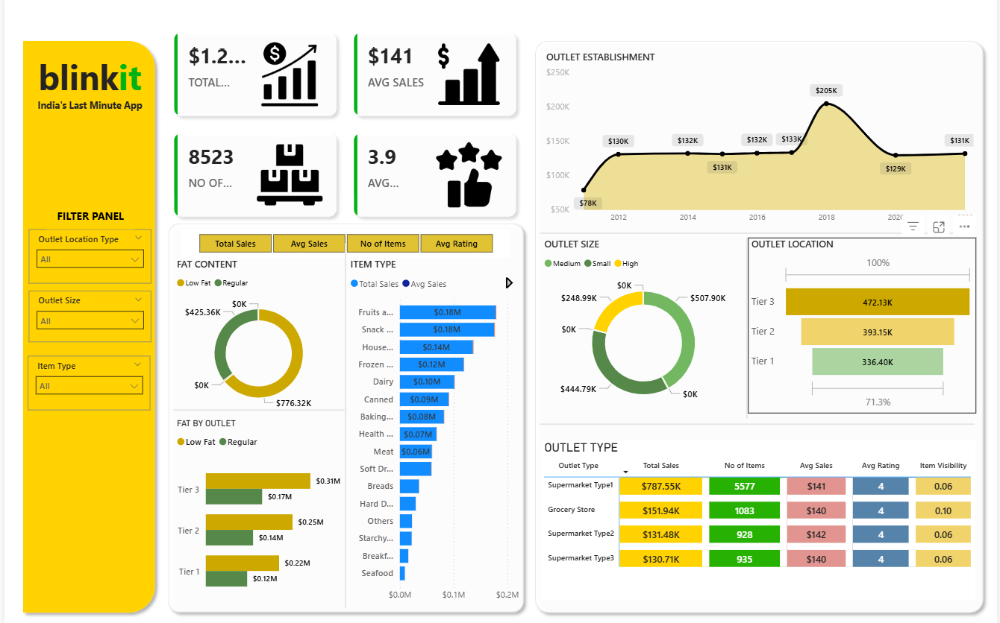

# Blinkit Sales Analysis Dashboard

An interactive **Power BI Sales Analytics Dashboard** built using Blinkit grocery sales data to analyze sales performance, outlet efficiency, and customer purchasing behavior.  
This project demonstrates **end-to-end data analytics workflow** from raw data cleaning to business-focused visualization.

---

## Project Objective
- Analyze overall sales performance
- Identify top-performing outlet types and sizes
- Understand customer preferences by item category
- Compare sales across outlet location tiers
- Enable data-driven business decision-making

---

## Dashboard Preview


---

## Business Overview
Blinkit is India’s last-minute grocery delivery platform.  
This dashboard provides insights into **sales trends, outlet performance, and product-level metrics** across multiple dimensions such as outlet size, location, establishment year, and item categories.

---

## Dataset Description

### Raw Dataset
- **File:** `blinkit_raw_data.xlsx`
- Contains original, unprocessed data
- Includes missing values and inconsistent labels
- Preserved for transparency and reproducibility

### Cleaned Dataset
- **File:** `blinkit_cleaned_data.xlsx`
- Cleaned and standardized for analysis
- Used directly in Power BI for modeling and visualization

### Why Raw & Cleaned Data Are Separated
- Maintains data integrity
- Allows reprocessing if needed
- Follows industry best practices for analytics projects

### Dataset Columns
| Column Name | Description |
|------------|------------|
| Item Identifier | Unique product ID |
| Item Type | Product category |
| Item Fat Content | Low Fat / Regular |
| Item Visibility | Product visibility score |
| Item Weight | Weight of the product |
| Sales | Total sales amount |
| Rating | Average customer rating |
| Outlet Identifier | Unique outlet ID |
| Outlet Establishment Year | Year outlet was opened |
| Outlet Location Type | Tier 1 / Tier 2 / Tier 3 |
| Outlet Size | Small / Medium / High |
| Outlet Type | Grocery Store / Supermarket Types |

---

## Data Cleaning & Preparation
- Removed duplicate records
- Standardized categorical values
- Handled missing and zero values
- Corrected inconsistent labels
- Converted data types
- Built data model and relationships
- Created calculated measures using DAX

---

## Dashboard Features

### Key KPIs
- Total Sales
- Average Sales
- Number of Items
- Average Customer Rating

### Visualizations
- Sales Trend by Outlet Establishment Year (Area Chart)
- Sales by Item Fat Content (Donut Chart)
- Sales by Outlet Size (Donut Chart)
- Sales by Item Type (Bar Chart)
- Sales by Outlet Location Tier (Bar Chart)
- Fat Content Distribution by Outlet Tier
- Outlet Type Performance Table:
  - Total Sales
  - Number of Items
  - Average Sales
  - Average Rating
  - Item Visibility

### Interactive Filters
- Outlet Location Type
- Outlet Size
- Item Type

---

## Key Insights
- Tier 3 outlets contribute the highest total sales
- Supermarket Type1 is the best-performing outlet type
- Medium-sized outlets generate maximum revenue
- Low-fat items have strong sales contribution
- Older outlets show stable long-term performance

---

## Repository Structure
```
blinkit-sales-analysis-dashboard/
│
├── data/
│ ├── blinkit_raw_data.xlsx
│ └── blinkit_cleaned_data.xlsx
│
├── images/
│ └── dashboard_overview.png
│
├── README.md
├── LICENSE
```
---

## Tools & Technologies
- Power BI Desktop
- DAX (Data Analysis Expressions)
- Microsoft Excel
- Data Cleaning & Transformation
- Business Intelligence & Data Visualization

---

## License
This project is licensed under the **MIT License**.

---
